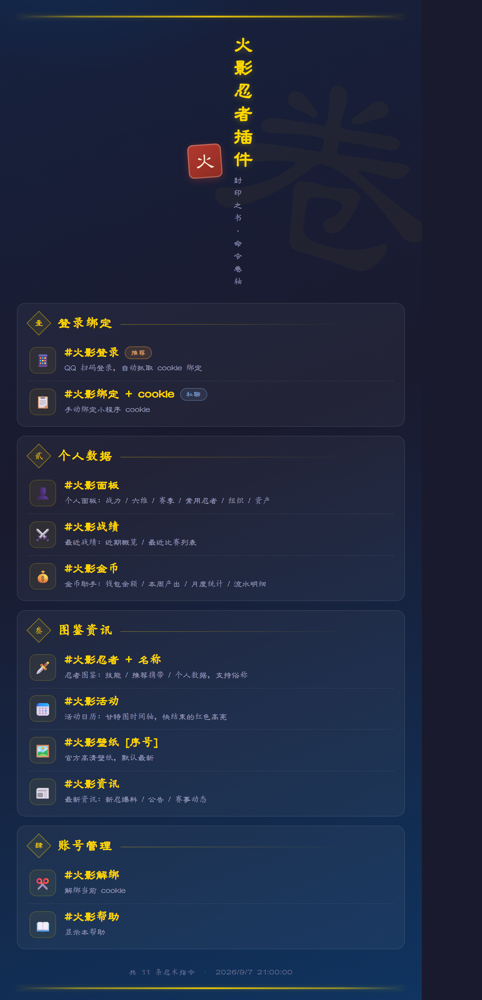
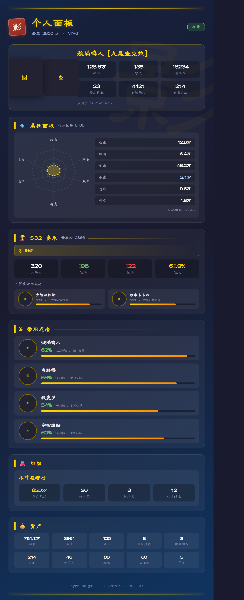
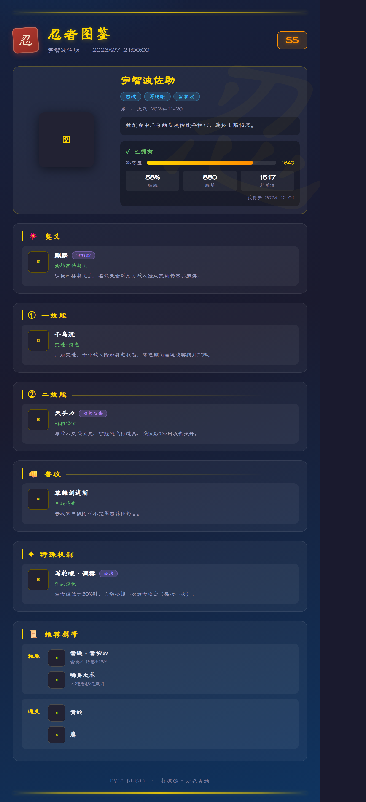
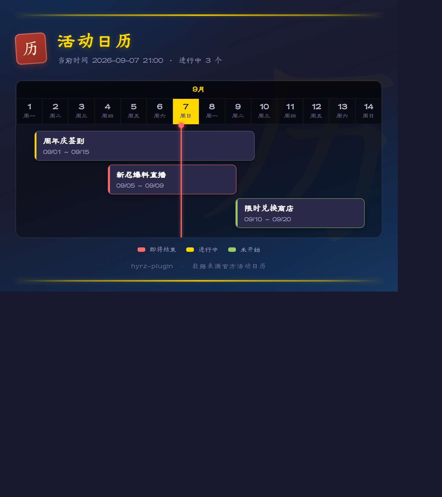

# hyrz-plugin · 火影忍者手游插件

基于 [TRSS-Yunzai](https://github.com/TimeRainStarSky/Yunzai) 的《火影忍者》手游 QQ 机器人插件：扫码登录绑定、个人面板、战绩查询、金币助手、忍者图鉴、活动日历、官方壁纸与资讯，全部以「封印之书 · 命令卷轴」水墨卷轴风格渲染出图。



## 功能一览

| 命令 | 说明 |
|---|---|
| `#火影帮助` | 命令卷轴帮助菜单 |
| `#火影登录` | QQ 扫码登录，自动抓取 cookie 绑定（推荐） |
| `#火影绑定 + cookie` | 手动绑定小程序 cookie（私聊） |
| `#火影面板` | 个人面板：战力 / 六维雷达 / 赛季 / 常用忍者 / 组织 / 资产 |
| `#火影战绩` | 最近战绩：近 100 场概览 / 赛季总览 / 最近对局 |
| `#火影金币` | 金币助手：钱包 / 每周任务产出 / 月度统计 / 流水明细 |
| `#火影忍者 + 名称` | 忍者图鉴：技能 / 推荐携带 / 个人使用数据，支持俗称（如 `#佐助技能`） |
| `#火影活动` | 活动日历：甘特图时间轴，临期活动高亮 |
| `#火影壁纸 [序号]` | 官方高清壁纸，默认最新，`#火影壁纸列表` 查看全部 |
| `#火影资讯` | 最新资讯：新忍爆料 / 公告 / 赛事动态 |
| `#火影解绑` | 解绑当前账号 cookie |

## 页面预览

| 个人面板 | 忍者图鉴 |
|---|---|
|  |  |

| 活动日历 |
|---|
|  |

## 安装

在 Yunzai 根目录执行：

```bash
git clone https://github.com/duci0007/hyrz-plugin.git ./plugins/hyrz-plugin
```

重启 Yunzai 即可使用，无额外依赖。

## 登录绑定

游戏账号（QQ 区 / 微信区）通过以下任一方式绑定：

1. **扫码登录（推荐）**：私聊发送 `#火影登录`，机器人回传二维码，手机 QQ 扫码确认后自动抓取 cookie 完成绑定
2. **手动绑定**：手机抓包小程序请求，复制 cookie（含 `openid` / `access_token`）后私聊发送 `#火影绑定 <cookie>`

绑定数据按 QQ 号独立存储于 `data/bindings/{QQ号}.json`，删除即解绑。

## 配置

`config/config.yaml`（首次运行自动生成）：

```yaml
# 网页登录链接前缀（#火影登录 生成网页链接用）
# 需公网可访问，如 http://your.domain.com:2536
# 留空则自动读取 Yunzai config/server.yaml 的 url
webLoginBase: ""
```

## 目录结构

```
hyrz-plugin/
├── apps/          # 命令入口（登录/绑定/面板/战绩/金币/图鉴/活动/帮助）
├── model/         # API 封装、扫码登录、忍者数据、绑定存储
├── server/        # 网页登录 express 路由
├── resources/     # 渲染模板（scroll.css 卷轴基础样式 + 各页面布局）
└── data/          # 运行数据（bindings/ 按QQ号存储）
```

## 说明

- 数据接口来自火影忍者手游官方活动页 / 小程序，仅供个人学习研究
- 界面统一「封印之书 · 命令卷轴」视觉体系：金色轴杆 + 朱红印章 + 淡金水印 + 隶书楷体书法字体
- 遇到问题发送 `#火影帮助` 查看可用命令
